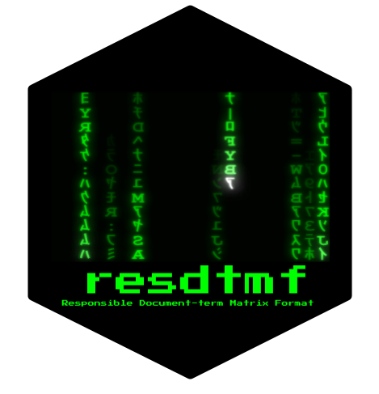

```{r xaringanExtra, echo = FALSE}
xaringanExtra::use_tile_view()
xaringanExtra::use_animate_all(params$animation)
xaringanExtra::use_logo(image_url = "img/mzes_logo.png", width = 280)
```
# R packages

* textsdc
* textplex
* resdtmf
* rectr

---

# textsdc

Statistical cleaning of text data

* Identify possible duplicates in text data by fuzzy matching and automatically remove them

URL: [https://github.com/chainsawriot/textsdc](https://github.com/chainsawriot/textsdc)

---
background-color: #282D35
class: middle, inverse

```{r, echo=FALSE}

```

---

# textplex

Calculate textual complexity using the algorithm by [Tolochko & Boomgaarden (2019)](https://ijoc.org/index.php/ijoc/article/view/9952).

* Calculate semantic and syntactic complexity of text

URL: [https://github.com/chainsawriot/textplex](https://github.com/chainsawriot/textplex)

---
background-color: #282D35
class: middle, inverse

```{r, echo=FALSE}

```

---

# resdtmf 



Responsible Document-term Matrix Format

* Machine readable format of document-term matrices with DublinCore 1.5 meta data.

URL: [https://github.com/chainsawriot/resdfmf](https://github.com/chainsawriot/textplex)

---

```json
{
  "triplets": [
    {
      "docid": "text1",
      "tid": 1,
      "f": 1
    },
    {
      "docid": "text3",
      "tid": 1,
      "f": 1
    },
    {
      "docid": "text1",
      "tid": 2,
      "f": 1
    },
    {
      "docid": "text2",
      "tid": 2,
      "f": 1
    },
    {
      "docid": "text1",
      "tid": 3,
      "f": 1
    },
    {
      "docid": "text2",
      "tid": 3,
      "f": 1
    },
    {
      "docid": "text3",
      "tid": 3,
      "f": 1
    },
    {
      "docid": "text2",
      "tid": 4,
      "f": 1
    },
    {
      "docid": "text3",
      "tid": 5,
      "f": 1
    }
  ],
  "features": [
    {
      "tid": 1,
      "term": "i"
    },
    {
      "tid": 2,
      "term": "love"
    },
    {
      "tid": 3,
      "term": "you"
    },
    {
      "tid": 4,
      "term": "me"
    },
    {
      "tid": 5,
      "term": "hate"
    }
  ],
  "dumped_docvars": [
    {
      "docid": "text1",
      "sentiment": 1
    },
    {
      "docid": "text2",
      "sentiment": 1
    },
    {
      "docid": "text3",
      "sentiment": 0
    }
  ],
  "dumped_meta": [],
  "order_of_content": [
    {
      "order": 1,
      "docid": "text1"
    },
    {
      "order": 2,
      "docid": "text2"
    },
    {
      "order": 3,
      "docid": "text3"
    }
  ]
}
```

---
background-color: #282D35
class: middle, inverse

```{r, echo=FALSE}

```

---

# rectr 


Reproducible Extraction of Cross-lingual Topics using R. 

(Top paper, ICA Computational Methods Interest Group.)

* Please refer to another ICA 2020 presentation.

URL: [https://github.com/chainsawriot/rectr](https://github.com/chainsawriot/rectr)

---

# Reproducible material for our articles

* How combining terrorism, Muslim, and refugee topics drives emotional tone in online news
    * [osf](https://osf.io/a4dqp/?view_only=96eab9d2ed714ba9b7350ab2e1a497b2) - DTM in resdtmf
* Reproducible Extraction of Cross-lingual Topics using R
    * [github](https://github.com/chainsawriot/rectr)

---

# R packages

* textsdc
* textplex
* resdtmf
* rectr

`r fontawesome::fa("twitter", fill = "#282D35")` @chainsawriot

[Slides](https://chainsawriot.github.io/ica2020_bluesky_mannheim/)

