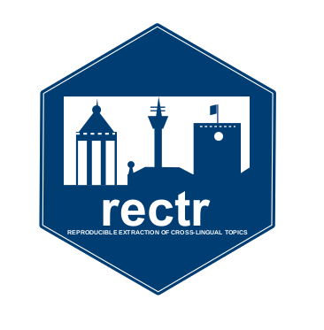

class: right middle hide-count
background-color: white
background-position: left

<link href="https://fonts.googleapis.com/css?family=Cedarville+Cursive|Karla|Montserrat|Open+Sans|Quattrocento|Raleway&display=swap" rel="stylesheet">


```{r setup, include=FALSE}
options(htmltools.dir.version = FALSE)
knitr::opts_chunk$set(highlight = TRUE)
```

```{r xaringan-themer, include=FALSE}
library(xaringanthemer)
mono_light(
  white_color = "#fff",
  header_font_google = google_font("Helvetica", "600"),
  text_font_google = google_font("Karla", "300", "300i"),
  code_font_google = google_font("Fira Code"),
  text_font_size = "24px",
  code_font_size = "1.2em"
)

opaque_box <- function(x) {
  htmltools::tags$div(
    class = "f1 bg-white-o90 pa6 shadow-3 h-75",
    htmltools::tags$h1(htmltools::tags$em(x))
  )
}

```

```{r xaringan-animate-all, echo=FALSE}
xaringanExtra::use_animate_all("fade")
xaringanExtra::use_tachyons()
xaringanExtra::use_text_poster()
```

```{css echo=FALSE}
a, a > code {
  color: #D55E00FF;
  text-decoration: none;
}

em {
  color: #D55E00FF;
  font-style: normal;
}

del {
  color: #E5E5E5;
  text-decoration: none;
  font-weight: normal;
}

.inverse del {
  color: #6C7B7F;
}

.bg-white-o90{
   background-color: rgba(255, 255, 255, 0.9);
}

.large { font-size: 175% }

.hide-count .remark-slide-number {
  display: none;
}

.text-poster {
	font-family: 'Cinzel', serif;
}

.inverse {
  color: #b9bfca;
  background-color: #282D35
}

.inverse.remark-slide-number {
  color: #b9bfca;
}

.remark-code-line-highlighted {
  color: #D55E00FF;
  background-color: transparent;
}

.remark-inline-code {
  color: #b9bfca;
}

.h2 {
  font-family: 'Karla'
}
```

.pull-right[
  # ResTeCo: Software and Data from the Mannheim Team
]

Chung-hong Chan

`r fontawesome::fa("twitter", fill = "#282D35")` @chainsawriot

---

# R packages

* textsdc
* textplex
* resdtmf
* rectr

---

# textsdc

Statistical cleaning of text data

* Identify possible duplicates in text data by fuzzy matching and automatically remove them

URL: [https://github.com/chainsawriot/textsdc](https://github.com/chainsawriot/textsdc)

---

class: middle, inverse

```{r, echo=FALSE}

```

---

# textplex

Calculate textual complexity using the algorithm by [Tolochko & Boomgaarden (2019)](https://ijoc.org/index.php/ijoc/article/view/9952).

* Calculate semantic and syntactic complexity of text

URL: [https://github.com/chainsawriot/textplex](https://github.com/chainsawriot/textplex)

---

class: middle, inverse

```{r, echo=FALSE}

```

---

# resdtmf 

Responsible Document-term Matrix Format

* Machine readable format of document-term matrices with DublinCore 1.5 meta data.

URL: [https://github.com/chainsawriot/resdfmf](https://github.com/chainsawriot/textplex)

---

```json
{
  "triplets": [
    {
      "docid": "text1",
      "tid": 1,
      "f": 1
    },
    {
      "docid": "text3",
      "tid": 1,
      "f": 1
    },
    {
      "docid": "text1",
      "tid": 2,
      "f": 1
    },
    {
      "docid": "text2",
      "tid": 2,
      "f": 1
    },
    {
      "docid": "text1",
      "tid": 3,
      "f": 1
    },
    {
      "docid": "text2",
      "tid": 3,
      "f": 1
    },
    {
      "docid": "text3",
      "tid": 3,
      "f": 1
    },
    {
      "docid": "text2",
      "tid": 4,
      "f": 1
    },
    {
      "docid": "text3",
      "tid": 5,
      "f": 1
    }
  ],
  "features": [
    {
      "tid": 1,
      "term": "i"
    },
    {
      "tid": 2,
      "term": "love"
    },
    {
      "tid": 3,
      "term": "you"
    },
    {
      "tid": 4,
      "term": "me"
    },
    {
      "tid": 5,
      "term": "hate"
    }
  ],
  "dumped_docvars": [
    {
      "docid": "text1",
      "sentiment": 1
    },
    {
      "docid": "text2",
      "sentiment": 1
    },
    {
      "docid": "text3",
      "sentiment": 0
    }
  ],
  "dumped_meta": [],
  "order_of_content": [
    {
      "order": 1,
      "docid": "text1"
    },
    {
      "order": 2,
      "docid": "text2"
    },
    {
      "order": 3,
      "docid": "text3"
    }
  ]
}
```

---

class: middle, inverse

```{r, echo=FALSE}
knitr::include_graphics("resdtmf.svg")
```

---

# rectr 

Reproducible Extraction of Cross-lingual Topics using R. 

(Top paper, ICA Computational Methods Interest Group.)

* Please refer to another ICA 2020 presentation.

URL: [https://github.com/chainsawriot/rectr](https://github.com/chainsawriot/rectr)

---

# Reproducible material for our articles

* How combining terrorism, Muslim, and refugee topics drives emotional tone in online news
    * [osf](https://osf.io/a4dqp/?view_only=96eab9d2ed714ba9b7350ab2e1a497b2) - DTM in resdtmf
* Reproducible Extraction of Cross-lingual Topics using R
    * [github](https://github.com/chainsawriot/rectr)

---

